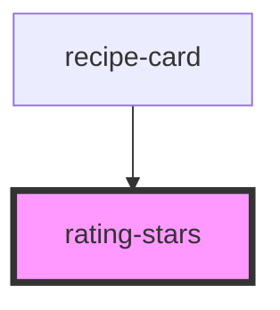

# rating-stars

<!-- Auto Generated Below -->

## Overview

A star rating that works as either a read-only indicator or an input.

When `readonly` is false the control is keyboard operable: arrow keys move
between values and Home/End jump to the ends, matching the ARIA slider
pattern that assistive technology already knows.

## Properties

| Property    | Attribute    | Description                                                      | Type      | Default    |
| ----------- | ------------ | ---------------------------------------------------------------- | --------- | ---------- |
| `label`     | `label`      | Accessible label for the control.                                | `string`  | `'Rating'` |
| `max`       | `max`        | Number of stars to render.                                       | `number`  | `5`        |
| `readonly`  | `readonly`   | When true the stars are a display-only indicator.                | `boolean` | `false`    |
| `showValue` | `show-value` | Renders the numeric value next to the stars.                     | `boolean` | `false`    |
| `size`      | `size`       | Star edge size in pixels.                                        | `number`  | `16`       |
| `value`     | `value`      | Current rating. Fractional values render partially filled stars. | `number`  | `0`        |

## Events

| Event          | Description                                                       | Type                              |
| -------------- | ----------------------------------------------------------------- | --------------------------------- |
| `ratingChange` | Fired when an interactive rating is changed by click or keyboard. | `CustomEvent<RatingChangeDetail>` |

## Dependencies

### Used by

 - [recipe-card](../recipe-card)

### Graph

----------------------------------------------

