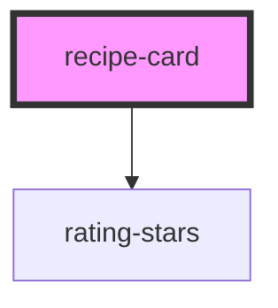

# recipe-card

<!-- Auto Generated Below -->

## Overview

A presentational card summarising a single recipe.

The component owns no state: `favorite` is controlled by the consumer, which
reacts to `favoriteToggle` and passes the new value back down. That keeps the
card usable from any framework without fighting over who owns the truth.

## Properties

| Property                | Attribute   | Description                                                              | Type      | Default     |
| ----------------------- | ----------- | ------------------------------------------------------------------------ | --------- | ----------- |
| `area`                  | `area`      | Cuisine or region label, e.g. "Italian".                                 | `string`  | `undefined` |
| `authored`              | `authored`  | Marks the recipe as user-created, which surfaces an "Own recipe" chip.   | `boolean` | `false`     |
| `category`              | `category`  | Category label, e.g. "Dessert". Rendered as the primary meta chip.       | `string`  | `undefined` |
| `compact`               | `compact`   | Renders a slimmer layout for dense grids and planner columns.            | `boolean` | `false`     |
| `favorite`              | `favorite`  | Whether the recipe is currently in the user's favorites.                 | `boolean` | `false`     |
| `image`                 | `image`     | Absolute or relative URL of the recipe image.                            | `string`  | `undefined` |
| `name` _(required)_     | `name`      | Recipe title shown as the card heading.                                  | `string`  | `undefined` |
| `rating`                | `rating`    | Optional 0-5 rating. Omit or set to 0 to hide the stars.                 | `number`  | `0`         |
| `recipeId` _(required)_ | `recipe-id` | Stable identifier passed back in every emitted event.                    | `string`  | `undefined` |
| `tags`                  | `tags`      | Comma-separated tag list, e.g. "Pasta,Quick". Blank entries are ignored. | `string`  | `undefined` |

## Events

| Event            | Description                                                  | Type                                |
| ---------------- | ------------------------------------------------------------ | ----------------------------------- |
| `favoriteToggle` | Fired when the favorite button is activated.                 | `CustomEvent<FavoriteToggleDetail>` |
| `recipeSelect`   | Fired when the card body or its primary button is activated. | `CustomEvent<RecipeSelectDetail>`   |

## Slots

| Slot        | Description                                                              |
| ----------- | ------------------------------------------------------------------------ |
|             | Free-form content rendered between the meta row and the actions.         |
| `"actions"` | Extra controls rendered in the card footer, next to the built-in button. |
| `"badge"`   | Content pinned to the top-left of the media area.                        |

## Dependencies

### Depends on

- [rating-stars](../rating-stars)

### Graph

----------------------------------------------

